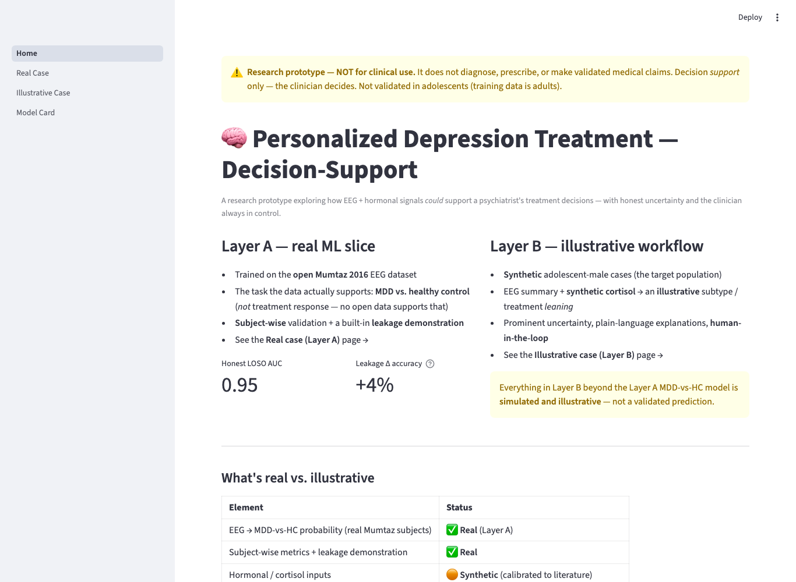
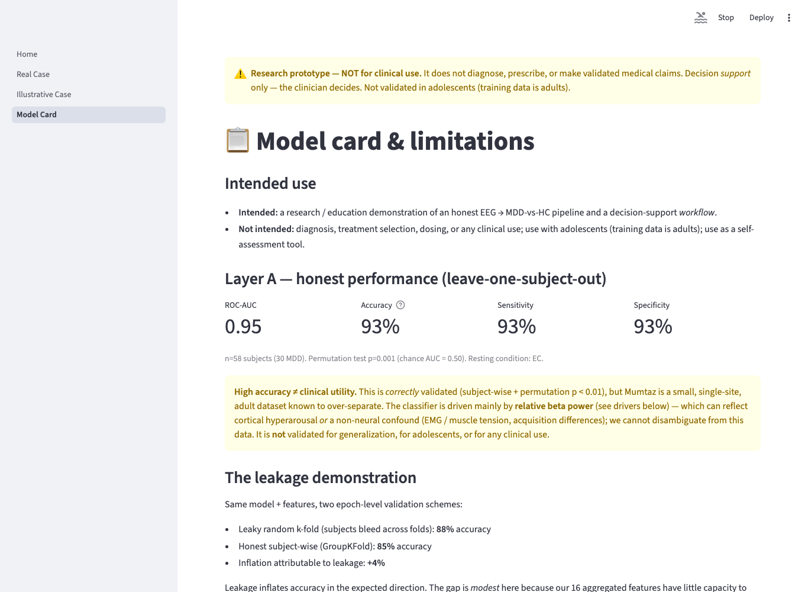
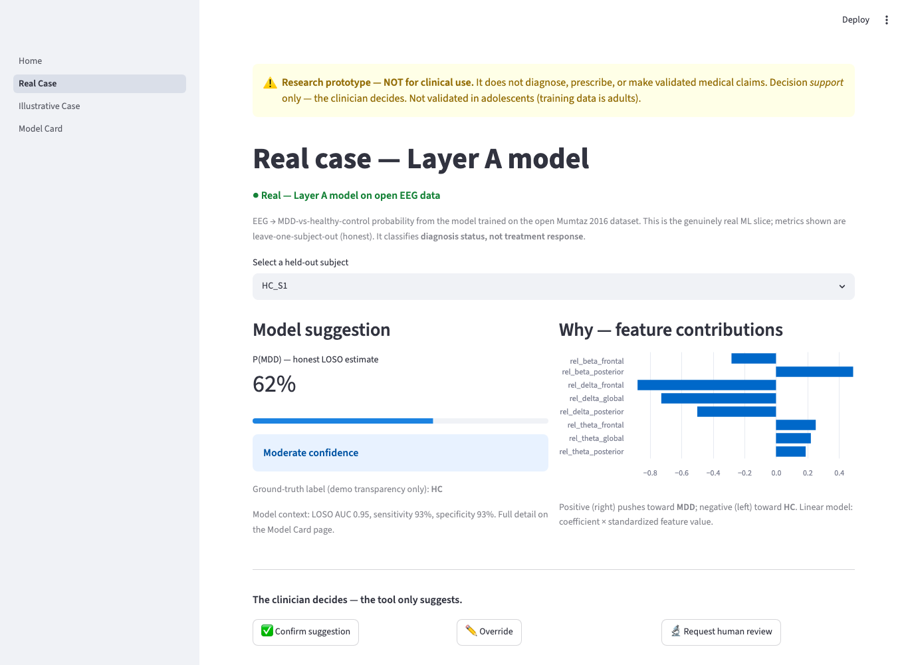
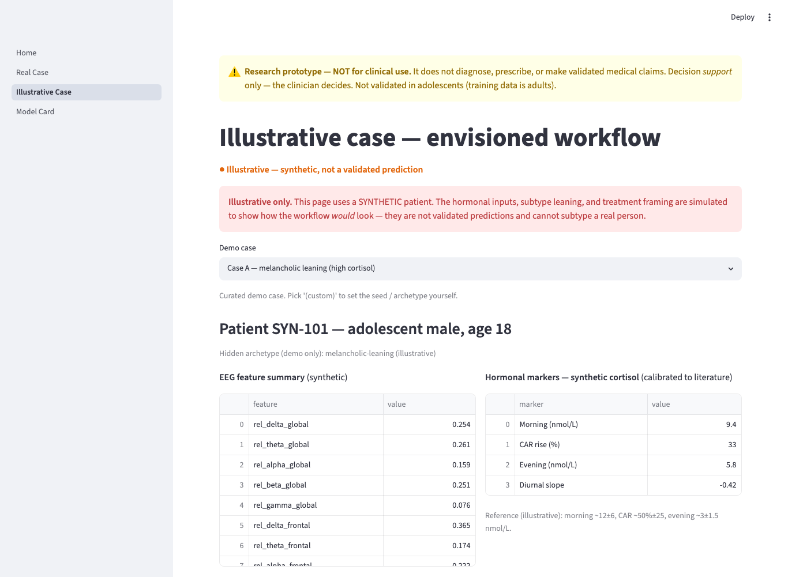

# Personalized Depression Treatment Decision-Support — Research Prototype

> ⚠️ **Research prototype — NOT for clinical use.** It does not diagnose, prescribe, or make validated medical claims. It is a decision-*support* concept demo for clinicians, on a vulnerable population — read `RESEARCH.md` for the honest scientific limits.

## What this is — real vs. illustrative

Two clearly-separated layers; the honesty of the separation is the point.

- **Layer A — real ML slice.** A genuine EEG → features → classifier pipeline trained on the open **Mumtaz 2016** dataset to distinguish **MDD vs. healthy control** — the only task open data supports, **not** treatment response. Validated with leakage-free **subject-wise** cross-validation, with honest metrics and a built-in demonstration of how the field's headline "98%" accuracies inflate under improper validation.
- **Layer B — illustrative clinician dashboard.** A Streamlit decision-support UI on **synthetic patient cases**. Treatment/subtype leanings and hormonal (cortisol) inputs are **simulated and explicitly labeled illustrative** — they show the *envisioned* workflow with visible uncertainty and clinician control, not validated predictions.

See `RESEARCH.md` (domain evidence + sources) and `PLAN.md` (scope, architecture, validation, risks).

## Screenshots

| Home — real vs. illustrative | Model Card — honest metrics + caveats |
|---|---|
|  |  |
| **Real Case — calibrated probability, explanation, human-in-the-loop** | **Illustrative Case — synthetic workflow** |
|  |  |

## Status
Layer A pipeline + Layer B dashboard are implemented and tested. The repository includes
lightweight derived artifacts (`data/features/mumtaz_subjects.csv`,
`ml/artifacts/metrics.json`, figures, and `model.pkl`) so the dashboard runs without
redistributing raw EEG. Raw EDF files are still excluded; use `data/download.md` only if
you want to regenerate the artifacts.

External transfer validation is wired but **not run** in this checkout because the
OpenNeuro fallback dataset is not present locally.

## Project structure
See `PLAN.md` §3.

## Setup & run

Requires **Python 3.11** (the repo pins a 3.11 virtualenv; the system 3.14 lacks some wheels).

```bash
# 1. Environment
python3.11 -m venv .venv
.venv/bin/python -m pip install -r requirements.txt

# 2. Data — browser download (see data/download.md); place .edf files in:
#    data/raw/mumtaz/

# 3. Optional: regenerate Layer A artifacts from raw EEG
.venv/bin/python -m ml.train --data-root data/raw/mumtaz --condition EC

# Optional: run EC/EO robustness after raw EEG is present
.venv/bin/python -m ml.robustness --data-root data/raw/mumtaz

# Optional: run external transfer after OpenNeuro ds003478 is present and verified
.venv/bin/python -m ml.transfer_eval --data-root data/raw/ds003478

# 4. Layer B — clinician dashboard (run from the project root)
.venv/bin/streamlit run app/Home.py

# Tests
.venv/bin/python -m pytest -q
```

The dashboard runs **without** regeneration because the derived Layer A artifacts are
checked in. If artifacts are deleted, Layer A panels show a "run training" hint and the
illustrative synthetic workflow still works.

## Responsible-AI commitments
Human-in-the-loop (the clinician decides), visible & calibrated uncertainty, explainability, automatic low-confidence flagging, synthetic-or-licensed data only, and a persistent "not for clinical use" notice. See `PLAN.md` §6.

## Submission materials
- `SUBMISSION.md` — project writeup (problem, approach, results, what's next)
- `SLIDES.md` — slide deck (render with [Marp](https://marp.app/) or `make-pdf`)
- `DEMO.md` / `VIDEO_SCRIPT.md` — live-demo walkthrough and recording script
- `RESEARCH.md` — sourced domain memo; `PLAN.md` — scope & architecture

## Acknowledgments & data attribution
- **EEG data:** Mumtaz, W. (2016). *MDD Patients and Healthy Controls EEG Data (New).* figshare, CC BY 4.0. https://doi.org/10.6084/m9.figshare.4244171.v2 — not redistributed here (see `data/download.md`).
- Built with MNE-Python, scikit-learn, and Streamlit.

## License
MIT (code only) — see `LICENSE`. This is a research prototype, **not** a medical device and **not** for clinical use.
