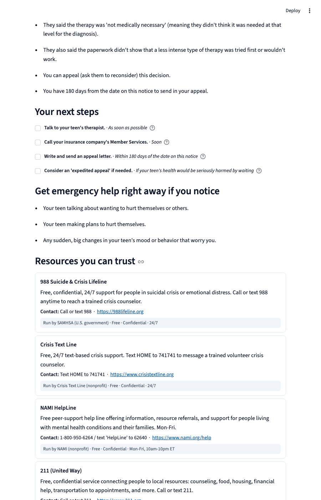

# ClearStep

**Confusing mental-health document? Paste it here. Get plain language, what matters most, a clear checklist, and trustworthy next steps.**

USAII Global AI Hackathon 2026 · High School track · Challenge 1: *Help is Hard to Find*



---

## The problem & who it's for

> **Jordan, 15, was just discharged from the ER after a mental-health crisis.** The
> paperwork says *"establish outpatient behavioral health within 7 days,"* lists
> medications, and buries the warning signs in clinical language. Jordan's mom reads
> it twice and still doesn't know what to actually **do** — and the 7-day clock has
> already started.

Help usually exists. People miss out because the information is scattered, the
language is dense, and it arrives in the worst moments to read carefully. ClearStep
is for the stressed teen or parent holding a confusing letter who needs to get from
**uncertainty → clarity → action**, fast.

## What ClearStep does

Paste any confusing mental-health document—discharge summary, school referral, insurance denial, form—and ClearStep gives you:

1. **A plain-language explanation** (about a 6th-grade reading level)
2. **An urgency flag** — emergency / time-sensitive / routine
3. **"What matters most"** — the few things you can't miss
4. **An action checklist** with timeframes ("call tomorrow", "within 7 days")
5. **Matched, trustworthy resources** — 988, Crisis Text Line, 211, SAMHSA, NAMI, and more, each with a source link and a "trust ribbon" (who runs it, free?, confidential?, available now?)
6. **An always-on crisis line** (988 on every screen) and a one-tap handoff to a real person
7. **A downloadable take-home sheet** you can keep or print

## Why AI — and not a web search

A search engine can't read *your specific letter*. ClearStep does per-document work a search or a static checklist cannot: it **understands this document's** jargon, **judges its** urgency, **rewrites it** at a 6th-grade level, and **maps it** to the right help. That is language understanding + summarization + classification + retrieval — the things AI is uniquely good at — applied to one stressful page.

## Our signature: honest AI

ClearStep is built on three pillars that set it apart.

### 1. We built a real depression-detection AI — then refused to use it

Our team actually trained a machine-learning model that detects depression from brain-wave (EEG) data — the rigorous way (leave-one-subject-out cross-validation, permutation test p≈0.001). It reached about **0.95 ROC-AUC** — but on **just 58 adults from one public dataset** (Mumtaz 2016, CC BY 4.0), and no EEG test for depression has ever been clinically validated. A high score on one small dataset is **not** a clinical instrument. So we **deliberately left it out of ClearStep.**

Why? Because no brain scan or algorithm can tell a scared parent what their child needs. A tool that announces *"your child is 82% likely depressed"* causes harm, not help. **The most responsible thing our AI does is refuse to guess about your family.** That restraint — the willingness to bench a powerful model because it's the right thing to do — is ClearStep.

### 2. The trust ribbon: you decide which help to trust

Every resource shows **who runs it** (government agency? nonprofit? volunteer line?), **is it free?**, **is it confidential?**, and **is it available now?** Because "help is hard to find" is really "I don't know which of these to trust." ClearStep gives you the facts so you decide.

### 3. Every result is stamped: "General information, not advice about your specific situation"

- ClearStep will **never diagnose** you or your child.
- The app gives **no medical advice** — it explains what the document says.
- ClearStep **can be wrong** or miss something — always confirm details with a real person before acting.
- **988 is on every screen.** If you or someone else is in danger now, call or text 988 or call 911.

---

## How it works (architecture)

```
  Confusing document (pasted text)
        │
        ▼
  ┌──────────────────────────────┐
  │  Retrieval (rag.py)          │   TF-IDF cosine match over a curated,
  │  scikit-learn TF-IDF         │   PUBLIC resource directory (resources.json).
  │  Never over private data.    │   Crisis lines (988, Crisis Text Line) are
  └──────────────────────────────┘   always included — a safety floor.
        │
        ▼
  ┌──────────────────────────────┐
  │  Generation (llm.py)         │   A language model (Gemini, Claude, or GPT-4)
  │  Provider-agnostic:          │   reads the document, classifies urgency,
  │  - Google Gemini (free tier) │   summarizes at 6th-grade level, and builds
  │  - Anthropic Claude          │   a checklist — grounded ONLY in retrieved
  │  - OpenAI GPT-4              │   resources. Constrained to explain, not advise.
  └──────────────────────────────┘
        │  structured JSON
        ▼
  ┌──────────────────────────────┐
  │  UI (app.py, Streamlit)      │   Crisis card (always on top) → urgency flag →
  │                              │   plain summary (original shown side-by-side) →
  │  - Crisis banner (988 always)│   key points → checklist → resources (with
  │  - Urgency & summary         │   trust ribbon) → human handoff.
  │  - Checklist & key points    │   Downloadable take-home sheet.
  │  - Matched resources         │
  │  - Download take-home        │
  └──────────────────────────────┘
```

| AI capability | Where | Implementation |
|---|---|---|
| NLP understanding & summarization | `llm.py` + `prompts.py` | Model understands jargon, extracts key info |
| Classification (urgency) | `llm.py` (structured JSON) | "emergency" / "urgent" / "routine" |
| Retrieval / RAG | `rag.py` over `resources.json` | scikit-learn TF-IDF cosine similarity |
| Grounded generation | `llm.py` | Model references only retrieved resources by id; never invents links |

---

## Responsible AI

### What could go wrong — and how we stop it

**Risk:** The AI could under-rate urgency, drop a critical instruction, or invent a resource.
A stressed reader might take the wrong action or miss a deadline.

**Guardrails built into the system:**

1. **988 is on every result**, shown to every user, regardless of the AI's urgency rating. Crisis lines are forced into the resource set.
2. **The original document is always displayed** beside the summary — nothing is hidden. The reader can verify the AI didn't miss or misread anything.
3. **Every resource carries a source link** and a trust ribbon. The reader can verify each one independently.
4. **The AI is constrained in its instructions** (`prompts.py`):
   - Explain what the document says; don't add medical advice of your own.
   - Only reference resources that were actually retrieved — never invent a phone number or link.
   - If something suggests immediate danger, flag urgency as "emergency" and route to 988/ER.
5. **A "honesty stamp" on every result:** *"This is general information, not advice about your specific situation. ClearStep can be wrong — always confirm with a real person before acting."*
6. **Human-in-the-loop:** ClearStep does not decide whether something is a true emergency and gives no medical advice. Those decisions route to trained humans (988, Crisis Text Line, the family's provider).

### Synthetic examples, public resources, benched model

- **Example documents:** All bundled examples (`examples/er_discharge.txt`, `examples/school_referral.txt`, `examples/insurance_denial.txt`) are synthetic. We wrote realistic mock letters. No real patient data is used or stored.
- **Resource directory:** `resources.json` contains only real public services with official links and verified metadata. Nothing is invented.
- **The EEG model:** Trained on public Mumtaz 2016 data (CC BY 4.0 licensed), it is not deployed in ClearStep. You can read the architecture and metrics in the "About our AI" section of the app — it's a cautionary exhibit showing responsible restraint, not a hidden medical decision engine.

---

## Run it

### Demo mode (no API key needed)

```bash
cd clearstep
python3 -m venv .venv
source .venv/bin/activate
pip install -r requirements.txt
streamlit run app.py
```

Pick a built-in example and click *Explain this for me*. The app runs on a cached AI result, no API key needed. Great for recording a demo or understanding the product with zero setup.

### Live mode (analyze custom text)

Any ONE of these API keys enables live analysis:

```bash
# Option 1: Google Gemini (free tier)
export GEMINI_API_KEY="your-gemini-key"

# Option 2: Anthropic Claude
export ANTHROPIC_API_KEY="your-claude-key"

# Option 3: OpenAI GPT-4
export OPENAI_API_KEY="your-openai-key"
```

Then run:

```bash
streamlit run app.py
```

Paste any document and click *Explain this for me*. The app will call whichever provider's key is set.

**Tip:** Put your key in a `.env` file in the `clearstep/` directory, and `load_dotenv()` will pick it up automatically.

```bash
# .env
GEMINI_API_KEY=sk-...
```

## Files

| File | Purpose |
|---|---|
| `app.py` | Streamlit UI: input field → result page with crisis banner, urgency, summary, checklist, resources, take-home download |
| `rag.py` | TF-IDF retrieval: ranks public resources by relevance; forces crisis lines into every result |
| `llm.py` | Provider-agnostic LLM call (Gemini, Claude, or GPT-4); falls back to cached demo results when no API key is set |
| `prompts.py` | System prompt and user message template; defines the JSON schema and constraints (explain, don't advise; cite only retrieved resources) |
| `resources.json` | Curated public resource directory: 988, Crisis Text Line, 211, SAMHSA, NAMI, The Trevor Project, Teen Line, JED, Trans Lifeline. Each entry has metadata: `run_by`, `free` (bool), `confidential` (bool), `availability` |
| `requirements.txt` | Dependencies: Streamlit, scikit-learn, python-dotenv, and optional AI provider SDKs |
| `examples/` | Synthetic sample documents for demo mode: `er_discharge.txt`, `school_referral.txt`, `insurance_denial.txt` |

---

## Data & honesty

**What we collect:** Nothing. The app stores no user data. Pasted text is sent to your chosen LLM provider (Gemini, Claude, or OpenAI) only to generate the explanation. Read that provider's privacy policy.

**Resources:** All real public services. Official links verified. No invented phone numbers.

**Examples:** Synthetic — we wrote realistic mock letters. No real patient data is used.

**The model:** Our trained EEG model is not deployed. It is shown as a static "About our AI" exhibit in the app, proving we built something powerful and chose not to use it in the critical path. Responsible AI means knowing when to refuse.

---

> **ClearStep is a research prototype, not a medical device, and gives no medical advice.**
> In an emergency, call or text **988** or call **911**.

Built with Claude Code (AI coding assistance, disclosed).
