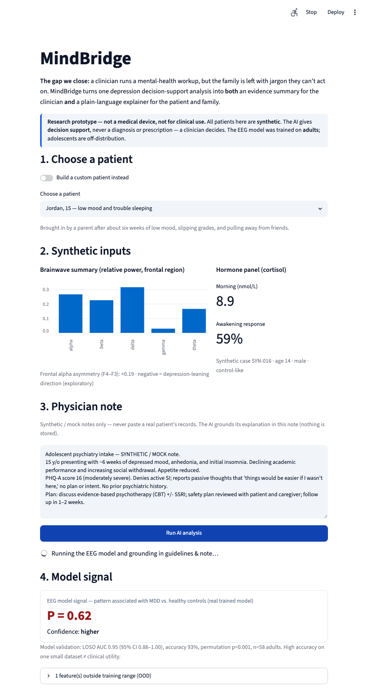

# 🧠 MindBridge

**One depression workup, two audiences: evidence for the clinician, plain language for the family.**

USAII Global AI Hackathon 2026 · High School track · Challenge 1: *Help is Hard to Find*



---

## The problem & who it's for

> **A parent whose 15-year-old just had a mental-health workup** is handed results full
> of specialist language — brainwave readings, cortisol levels, terms like *"frontal
> alpha asymmetry."* The information that could help is right there, but it's locked
> behind language built for doctors, not families. So the parent leaves confused, and
> the next step never happens.

Help is hard to find not because it doesn't exist, but because it arrives in a form a
stressed family can't use. **MindBridge** bridges that gap: it takes a clinical
depression workup and turns it into something **both** the clinician **and** the family
can act on — moving a scared family from *confusion → clarity → action.*

## What it does

You pick a (synthetic) patient. MindBridge runs a **real, trained EEG model**, grounds
the result in **clinical guidelines (RAG)**, and produces two views of the same analysis:

- **👩‍⚕️ Clinician view:** a calibrated, uncertainty-aware signal + guideline-cited
  evidence to weigh + safety checks — explicitly *decision support, not a decision.*
- **👨‍👩‍👧 Family view:** the same workup in plain 6th-grade language — what it means,
  what matters most, a next-step checklist, and trusted support resources, with a **988
  crisis card always on screen.**

## Why AI — and not a pamphlet or web search

A generic pamphlet can't read *this* patient's results. MindBridge does per-case work:
it **classifies** the EEG signal with a trained model, **judges its uncertainty**,
**retrieves** the guidelines and resources that fit, and **rewrites** specialist data
into plain language a family can act on. That's classification + retrieval + language
generation applied to one specific workup — exactly what AI is for.

## How it works (architecture)

```
  Synthetic patient (EEG features + cortisol panel + context)
        │
        ├─► model_engine.py — REAL trained EEG classifier (scikit-learn logistic
        │     regression, LOSO-validated AUC ~0.95, p<0.001) → calibrated P(MDD),
        │     confidence band, out-of-distribution flags
        │
        ├─► rag.py — TF-IDF retrieval (RAG) over TWO public corpora:
        │     guidelines.json (cited clinical guidance) + resources.json (988, 211…)
        │
        ▼
  llm.py — an LLM (Google Gemini by default) grounds both outputs in the evidence:
        • clinician evidence summary (every point cites a guideline)
        • family plain-language explainer (checklist + linked resources)
        │
        ▼
  app.py — Streamlit: model signal → Clinician tab + Family tab → human-in-the-loop log
```

| AI capability | Where |
|---|---|
| Classification (trained model) | `model_engine.py` + `model.pkl` |
| Retrieval / RAG | `rag.py` over `guidelines.json` + `resources.json` |
| Generative AI (plain language, grounded) | `llm.py` + `prompts.py` |

## Responsible AI

- **The AI never diagnoses or prescribes.** It surfaces an uncertain signal and cited
  evidence; the **clinician makes every clinical decision** (human-in-the-loop, logged).
- **A low signal is not "all clear."** The tool says so explicitly — a key guardrail
  against false reassurance.
- **Uncertainty is always visible:** calibrated probability, a low-confidence band, the
  model's wide validation CIs, and out-of-distribution flags.
- **Grounded, not invented:** clinician evidence cites only retrieved guidelines; family
  resources come only from the curated public list. The **988 line shows on every result.**
- **Synthetic data only.** No real patient data is used in the app.

## Honesty about the science

This is built on a real, careful ML pipeline — *and* on what that pipeline cannot do.
The EEG model genuinely separates MDD vs. healthy controls on one small **adult** dataset
(Mumtaz 2016), but **no EEG or hormonal marker is validated to diagnose or select
treatment for an individual** (see `guidelines.json` → *"Biomarkers do not select
treatment"*). MindBridge is designed around that honesty: the model is a *clue*, the
clinician is the decision-maker, and the family gets understanding — not a verdict.

## Run it

```bash
cd mindbridge
python3 -m venv .venv && source .venv/bin/activate
pip install -r requirements.txt
streamlit run app.py
```

- **No setup needed:** the three built-in demo patients run fully — the **model signal is
  always live**, and the written output is cached (great for a demo video).
- **Live mode:** copy `.env.example` → `.env` and add ONE API key — `GEMINI_API_KEY`,
  `ANTHROPIC_API_KEY`, or `OPENAI_API_KEY` (provider auto-detected) — to analyze custom
  synthetic patients with live AI text. Gemini's free tier is the zero-cost option.

## Files

| File | Purpose |
|---|---|
| `app.py` | Two-audience Streamlit UI |
| `model_engine.py` | Loads the real EEG model; signal + uncertainty + OOD flags |
| `rag.py` | TF-IDF retrieval over guidelines + resources |
| `llm.py` | LLM dual-audience generation (Gemini / Claude / OpenAI) + demo-mode fallback |
| `prompts.py` | Explain-don't-prescribe system prompt + schema |
| `guidelines.json` | Curated, cited clinical-guideline corpus (RAG) |
| `resources.json` | Curated public support resources (RAG) |
| `synthetic.py` | Synthetic patient generator (from the EEG project) |
| `model.pkl`, `metrics.json` | Trained model + validation metrics |

> ⚠️ Research prototype, **not a medical device**. Synthetic data only. In an emergency,
> call or text **988** or call **911**.

Built with [Claude Code](https://claude.com/claude-code) (AI coding assistance, disclosed).
The EEG model reuses the trained artifact from our companion project (archived on the
`eeg-archive` branch).
