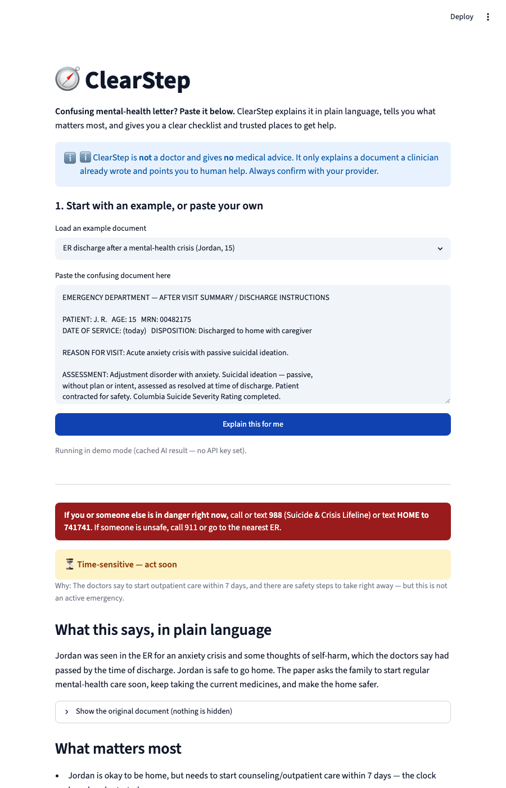

# 🧭 ClearStep

**Turns confusing mental-health letters into plain language and clear next steps.**

USAII Global AI Hackathon 2026 · High School track · Challenge 1: *Help is Hard to Find*



---

## The problem & who it's for

> **Jordan, 15, was just discharged from the ER after a mental-health crisis.** The
> paperwork says *"establish outpatient behavioral health within 7 days,"* lists
> medications, and buries the warning signs in clinical language. Jordan's mom reads
> it twice and still doesn't know what to actually **do** — and the 7-day clock has
> already started.

Help usually *exists*. People miss out because the information is scattered, the
language is dense, and it arrives in the worst moments to read carefully. ClearStep
is for the stressed teen or parent holding a confusing letter who needs to get from
**uncertainty → clarity → action**, fast.

## What ClearStep does

Paste the confusing document and ClearStep gives you:

1. **A plain-language explanation** (about a 6th-grade reading level)
2. **An urgency flag** — emergency / time-sensitive / routine
3. **"What matters most"** — the few things you can't miss
4. **An action checklist** with timeframes ("call tomorrow", "within 7 days")
5. **Matched, verified resources** — 988, Crisis Text Line, 211, SAMHSA, NAMI… each with a source link
6. **An always-on crisis card and a one-tap handoff to a real person**

## Why AI — and not a web search

A search engine can't read *your specific letter*. ClearStep does per-document work a
search or a static checklist cannot: it **understands this document's** jargon,
**judges its** urgency, **rewrites it** at a 6th-grade level, and **maps it** to the
right help. That is language understanding + summarization + classification +
retrieval — the things AI is uniquely good at — applied to one stressful page.

## How it works (architecture)

```
  Confusing document (pasted text)
        │
        ▼
  ┌─────────────────────────┐   RAG: TF-IDF cosine match over a curated,
  │  rag.py  (Retrieval)    │   PUBLIC resource directory (resources.json).
  │  scikit-learn TF-IDF    │   Never over private/patient data.
  └─────────────────────────┘
        │  top resources (with source links) + always-on crisis lines
        ▼
  ┌─────────────────────────┐   Claude reads the document, classifies urgency,
  │  llm.py  (Generation)   │   summarizes at a 6th-grade level, and builds a
  │  Anthropic Claude       │   checklist — grounded ONLY in retrieved resources.
  └─────────────────────────┘
        │  structured JSON
        ▼
  ┌─────────────────────────┐   Crisis card (always) → urgency → plain summary
  │  app.py  (Streamlit UI) │   (original shown side-by-side) → key points →
  │                         │   checklist → resources → human handoff.
  └─────────────────────────┘
```

| AI capability | Where |
|---|---|
| NLP understanding & summarization | `llm.py` + `prompts.py` |
| Classification (urgency) | `llm.py` (structured output) |
| Retrieval / RAG | `rag.py` over `resources.json` |
| Generative AI (plain language) | `llm.py` |

## Responsible AI

- **Risk addressed:** the AI could under-rate urgency or drop a critical instruction,
  so a stressed reader takes the wrong action.
- **Guardrails built into the UI:**
  - **988 is shown on every result**, regardless of the AI's urgency rating.
  - The **original document is always displayed** beside the summary — nothing hidden.
  - **Every resource carries a source link** so the reader can verify it.
  - The model is constrained to **explain, not advise**, and to reference **only
    retrieved resources** (no invented phone numbers or links).
- **Human-in-the-loop:** ClearStep does **not** decide whether something is a true
  emergency and gives **no** medical advice — those decisions route to a trained
  human (988, Crisis Text Line, the family's provider).

## Run it

```bash
cd clearstep
python3 -m venv .venv && source .venv/bin/activate
pip install -r requirements.txt
streamlit run app.py
```

- **Demo mode (no setup):** pick a built-in example and click *Explain this for me* —
  it runs on a cached AI result, no API key needed. Great for recording a demo.
- **Live mode (custom text):** copy `.env.example` to `.env`, add your
  `ANTHROPIC_API_KEY`, and ClearStep will analyze any document you paste.

## Files

| File | Purpose |
|---|---|
| `app.py` | Streamlit UI (input → result) |
| `rag.py` | TF-IDF retrieval over the public resource directory |
| `llm.py` | Claude call + structured output + demo-mode fallback |
| `prompts.py` | The system prompt and structured-output schema |
| `resources.json` | Curated public resource directory (with source links) |
| `examples/` | Synthetic sample documents (no real patient data) |

## Data & honesty

All resources are **real public services** with official links. All example documents
are **synthetic** — we wrote realistic mock letters; **no real patient data is used**.
The app stores nothing; pasted text is sent to the Claude API only to generate the
explanation.

> ⚠️ ClearStep is a hackathon prototype. It is **not** a medical device and gives **no**
> medical advice. In an emergency, call or text **988** or call **911**.

Built with [Claude Code](https://claude.com/claude-code) (AI coding assistance, disclosed).
